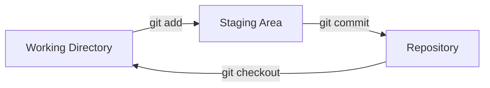

## ステップ 2: はじめてのリポジトリを作成する

サンプルプロジェクトを確認し、Git に自分の情報も伝えられました。次は、ゲームをバージョン管理に入れてみましょう。

### 理論: Git のワークフロー

Git のワークフローには、主に 3 つの領域があります。

- **Working Directory**: 変更しているプロジェクトファイルがある場所です。
- **Staging Area (Index)**: 履歴に保存したい変更をまとめる準備場所です。
- **Repository**: プロジェクト開発履歴の永続的な記録です。



### 重要な Git コマンド

Git には多くの操作がありますが、ローカルプロジェクトでよく使うコマンドは次のとおりです。

- `git init`: 新しいリポジトリを開始し、バージョン管理を有効にします。
- `git add`: 関連する変更をステージングエリアにまとめ、履歴へコミットする準備をします。
- `git commit`: ステージングエリアの変更をプロジェクト履歴へ保存します。
  - commit message: 履歴を整理しやすくするための、変更内容を表す短い説明です。
- `git status`: 作業ディレクトリとステージングエリアの現在の状態を表示します。
- `git checkout`: リポジトリ履歴内の別のバージョンへ作業ディレクトリを切り替えます。

> [!TIP]
> コミットメッセージを軽く見ないでください。明確で簡潔、具体的で汎用的すぎないメッセージは、あとから履歴を理解したり不具合を探したりするときにとても役立ちます。

### アクティビティ 1: CLI でプロジェクトリポジトリを初期化する

ゲームにバージョン管理を追加し、現在の状態をコミットします。

1. ターミナルでプロジェクトディレクトリへ移動します。

   ```bash
   cd /workspaces/stack-overflown
   ```

1. 新しい Git リポジトリを初期化します。

   ```bash
   git init
   ```

1. リポジトリの状態を確認します。`No commits yet` と、`git add` を使うヒントが表示されることに注目してください。

   ```bash
   git status
   ```

   

1. ゲームファイルをステージングエリアへ追加します。これでコミットの準備ができます。

   ```bash
   git add src/index.html
   git add src/index.js
   git add src/patterns.js
   git add src/style.css
   ```

   または、次のようにまとめて追加できます。

   ```bash
   git add src/*
   ```

1. もう一度リポジトリの状態を確認します。各ファイルが `new file` として表示されることに注目してください。

   ```bash
   git status
   ```

   

1. 変更をリポジトリ履歴へコミットします。これでプロジェクト履歴が始まりました。

   ```bash
   git commit -m "Initial commit"
   ```

   

1. リポジトリの状態を確認します。`working tree clean` は、現在の作業コピーが履歴と完全に一致していることを意味します。

   ```bash
   git status
   ```

   

### アクティビティ 2: VS Code でファイルを編集する

次はコードエディタからファイルを追加してみます。ここではゲームのドキュメントを作成します。

1. ファイルエクスプローラーで **New File...** アイコンをクリックし、次の名前で README ファイルを作成します。`./stack-overflown/` フォルダー内に作成してください。

   ```txt
   README.md
   ```

   

1. ファイルを開き、次の内容を入力します。

   ```md
   # Stack Overflown

   Organize the falling blocks into the current debug pattern before the stack overflows!
   ```

1. 左側のナビゲーションで **Source Control** タブを選択します。**Changes** エリアに `README.md` が表示されることを確認します。

   

1. ファイルにカーソルを合わせ、プラス記号 `+` ボタンを選択してステージングエリアへ追加します。

   

1. コミットメッセージを入力し、**Commit** ボタンを押します。

   ```txt
   Start game documentation
   ```

   

1. 2 つ目のコミットとして、`README.md` に次の内容も追加します。

   ```md
   ## How to Develop

   - `index.html` - the game container for playing
   - `index.js` - the primary game logic
   - `patterns.js` - the error patterns to match during gameplay
   - `style.css` - the game formatting and styling
   ```

1. 変更をステージングし、次のメッセージでコミットします。

   ```txt
   Start developer docs
   ```

   

1. 新しいコミットを追加すると、Mona が作業内容の確認を始めます。少し待って、コメント欄を確認してください。進捗情報と次のステップが投稿されます。

<details>
<summary>うまくいかない場合</summary><br/>

- `git status` に意図しないファイルが表示される場合は、`git restore --staged <filename>` でステージングから外せます。

</details>
