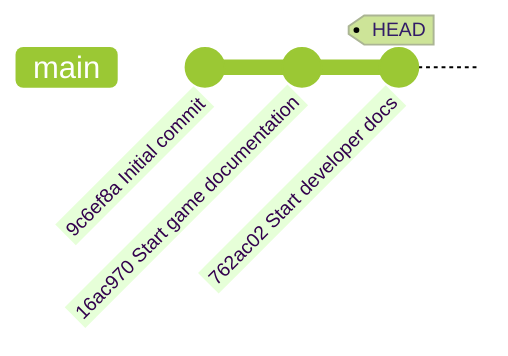

## ステップ 3: Git 履歴を調べる

ゲームが Git で管理されるようになりました。次は、どの変更が、いつ、誰によって行われたのかを確認する方法を学びます。

### 理論: Git 履歴を理解する

Git はコミットを通じて、プロジェクトの完全な履歴を保持します。各コミットには次の情報が含まれます。

- **一意のハッシュ ID**: 履歴内でコミットを参照するための識別子です。
- **親コミット**: 直前のコミットへの参照です。これにより履歴が鎖のようにつながります。
- **作者情報**: 誰が変更したかを表します。
- **タイムスタンプ**: 変更が適用された日時です。
- **コミットメッセージ**: そのコミットに含まれる変更の説明です。

また、`HEAD` ポインタは、プロジェクト履歴内で現在どこにいるかを示す特別なラベルです。あなたのプロジェクトは、おそらく次の図に近い状態になっています。



### 重要な Git コマンド

履歴の見方には好みがあり、コミュニティによって多くの選択肢が作られています。よく使うコマンドとオプションは次のとおりです。

- `git log`: プロジェクトの詳しい履歴を表示します。
  - `git log --oneline`: 1 コミットを 1 行で簡潔に表示します。
  - `git log --graph`: 分岐した履歴を見るときに便利な図を表示します。
- `git checkout`: 履歴内の別の地点へ移動します。作業ディレクトリのファイルも切り替わります。

### アクティビティ 1: CLI で履歴を調べる

1. 詳細なコミット履歴を表示します。

   ```bash
   git log
   ```

   

1. 1 コミット 1 行で表示します。

   ```bash
   git log --oneline
   ```

   

1. コミット履歴全体をグラフで表示します。

   ```bash
   git log --graph --oneline
   ```

   > **メモ**: 履歴がさらに長くなる後のステップでは、より見応えのある表示になります。

1. `Initial commit` の **Commit ID** をコピーします。長い形式でも短い形式でも使えます。

1. コピーした ID を使って、以前のバージョンへチェックアウトします。

   ```bash
   git checkout <commit id>
   ```

   <br/>

   `README.md` ファイルが削除されたように見えることに注目してください。

   

1. `main` の最新コミットへ戻ります。`README.md` が戻ってくることを確認します。

   ```bash
   git checkout main
   ```

   <br/>

   

### アクティビティ 2: VS Code で履歴を調べる

1. 左側のナビゲーションで **Source Control** タブを開きます。

1. **Changes** 見出しを右クリックし、**Graph** オプションを有効にします。

   

1. **Graph** パネルを確認します。最近のコミットが時系列で表示されることに注目してください。

   <br/>

1. コミット名をクリックし、そのコミットで変更されたファイル一覧を展開します。

   

1. Git 履歴の確認が終わると、Mona が作業内容の確認を始めます。少し待って、コメント欄を確認してください。進捗情報と次のステップが投稿されます。

<details>
<summary>うまくいかない場合</summary><br/>

- 履歴表示に使えるオプションを確認するには、`git log --help` を実行してください。

</details>
