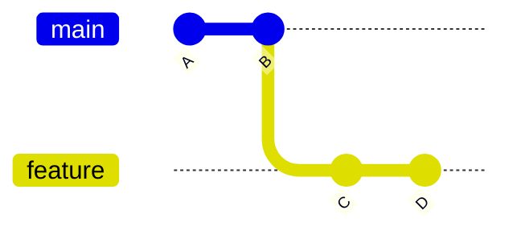
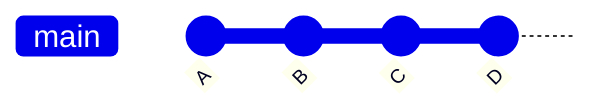
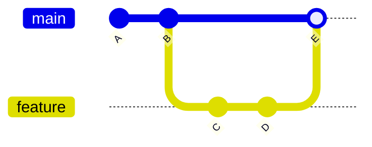
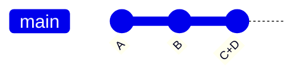

## ステップ 5: ブランチを使う

ゲームが Git で管理されるようになり、動いていた状態へ戻しやすいことがわかりました。また、履歴へコミットする前に正確な変更内容を確認できるので、関係ない変更を混ぜずに済みます。

では、次の疑問が出てきます。

「履歴が散らからないようにするにはどうすればいいか」

「途中までの未完成な作業を、動く履歴へ入れないようにするにはどうすればいいか」

「複数の機能や修正を同時に進めたいときはどうすればいいか」

### 理論: ブランチを理解する

Git のブランチは、特定のコミットを指す軽量なポインタ、つまりラベルのようなものです。元の状態に影響を与えず、別の流れで作業できます。並行した機能開発や共同作業にとても便利です。

重要な概念は次のとおりです。

- **`main` ブランチ**: 通常、信頼できる動作版です。最初に作られるブランチでもあります。歴史的には `master` と呼ばれていました。
- **Feature Branch**: 信頼できる版に影響を与えず開発するための、安全に分離された場所です。
- **Merging**: 異なるブランチの変更をまとめることです。

### ブランチはどうやって統合するのか

コミットを整理する方法には複数の戦略があります。どれも、整理のしやすさ、透明性、追跡しやすさのために使われます。ここでは代表的なものを紹介します。

**Fast-forward merge**: 子ブランチの新しいコミットを、親ブランチの先へそのまま進めます。

<div align="center">

**Before:** Original



**After:** Fast Forward Merge



</div>

**Merge commit**: 親ブランチ上に新しい 1 つのコミットとして変更を取り込みます。追跡しやすいように、子ブランチの流れも履歴に残ります。

<div align="center">

**Before:** Original


**After:** Merge Commit



</div>

**Squash merge**: 片方のブランチにある複数のコミットを、もう片方のブランチ上の 1 つの新しいコミットへまとめます。

<div align="center">

**Before:** Original


**After:** Squash Commit



</div>

### 重要な Git コマンド

- `git branch my-new-feature`: 現在のブランチから新しいブランチを作成します。
- `git checkout my-new-feature`: 作業ディレクトリをリポジトリ履歴内の別の版へ切り替えます。
- `git merge`: あるブランチのコミットを別のブランチへ適用します。既定では Fast-forward merge です。

> [!TIP]
> Git 2.23 では、ブランチ管理を簡単にする `git switch` コマンドが導入されました。今後目にする機会が増えるかもしれません。

### アクティビティ 1: CLI でブランチへコミットする

ブランチを作成し、そのブランチで変更をコミットしてみましょう。

1. 始める前に、現在の履歴を確認します。まだブランチがなく、完全に直線的な履歴であることに注目してください。

   ```bash
   git log --all --graph --oneline
   ```

   

1. 新しいブランチを作成し、そのブランチへ切り替えます。

   ```bash
   git branch fix-incomplete-high-score
   git checkout fix-incomplete-high-score
   ```

1. 利用できるブランチ一覧を表示します。

   ```bash
   git branch --list
   ```

   

1. High Score 機能を直すため、`index.js` を開きます。

1. `line 41` に high score 用の変数を追加し、コミットします。

   ```js
   let highScore = 0;
   ```

   ```bash
   git add src/index.js
   git commit -m "Add new variable for tracking high score"
   ```

1. `line 61` に、local storage からスコアを読み込むコードを追加し、コミットします。

   ```js
   // Load high score from localStorage
   highScore = parseInt(localStorage.getItem("stackOverflownHighScore")) || 0;
   document.getElementById("high-score").textContent = highScore;
   ```

   ```bash
   git add src/index.js
   git commit -m "Add loading of stored high score"
   ```

1. `line 313` の `updateScore` 関数を次の内容に置き換え、最高スコアを記録するようにしてからコミットします。

   ```js
   function updateScore() {
     document.getElementById("score").textContent = score;

     // Update high score if current score exceeds it
     if (score > highScore) {
       highScore = score;
       document.getElementById("high-score").textContent = highScore;
       localStorage.setItem("stackOverflownHighScore", highScore);
     }
   }
   ```

   ```bash
   git add src/index.js
   git commit -m "Add logic to keep track of highest score"
   ```

1. もう一度履歴グラフを確認します。Feature branch には `main` より 3 つ多くコミットがあり、現在の位置を示す `HEAD` も付いていることに注目してください。

   ```bash
   git log --all --graph --oneline
   ```

   

1. `main` ブランチへ戻ります。

   ```bash
   git checkout main
   ```

1. 新しい機能をマージします。

   > **メモ:** 学習のため、ここでは "not fast forward" オプションを使い、ブランチが履歴上で見えるようにします。履歴グラフも見やすくなります。

   ```bash
   git merge --no-ff fix-incomplete-high-score -m "Fix high score tracker"
   ```

   

1. もう一度履歴グラフを確認します。並行していたブランチがマージされたことに注目してください。

   ```bash
   git log --all --graph --oneline
   ```

   

1. すでにマージ済みで不要になったため、Feature branch のポインタ、つまり名前を削除します。

   ```bash
   git branch --delete fix-incomplete-high-score
   ```

   > **メモ**: これはブランチの中身を削除する操作ではありません。参照に使っていた名前だけを削除します。

### アクティビティ 2: VS Code でブランチへコミットする

1. 左側のナビゲーションで **Source Control** タブを開きます。ステップ 3 で表示した **Graph** パネルも見える状態にして、変更に応じて更新される様子を確認します。

1. 左下のステータスバーでブランチ名 `main` をクリックします。メニューが表示されます。

   <br/>

1. **Create new branch...** を選択し、次の名前を使います。

   

   ```txt
   add-level-counter
   ```

   

1. `index.html` を開きます。`line 21` に現在のレベルを表示する要素を追加し、変更をコミットします。

   ```diff
   <h3>Level</h3>
   <div class="score" id="level">1</div>
   ```

   コミットメッセージ:

   ```bash
   Add element to display current level
   ```

1. レベルカウンターを追加するため、`index.js` を開きます。

1. `line 42` にレベルを追跡する 2 つの変数を追加し、コミットします。

   ```js
   let level = 1;
   let patternsCleared = 0;
   ```

   コミットメッセージ:

   ```bash
   Add variables for level and clear counter
   ```

1. `line 273` の `checkPatternMatch` メソッドを次の内容に置き換え、コミットします。

   ```js
   function checkPatternMatch() {
     for (let startRow = 0; startRow <= ROWS - PATTERN_SIZE; startRow++) {
       for (let startCol = 0; startCol <= COLS - PATTERN_SIZE; startCol++) {
         if (matchesPattern(startRow, startCol)) {
           clearPattern(startRow, startCol);
           score += 100;
           patternsCleared++;
           if (patternsCleared % 5 === 0) {
             level++;
             dropInterval = Math.max(200, 1000 - (level - 1) * 100);
             document.getElementById("level").textContent = level;
           }
           updateScore();
           setNewTargetPattern();
           return;
         }
       }
     }
   }
   ```

   コミットメッセージ:

   ```bash
   Add logic to calculate level
   ```

1. **Graph** パネルに、新しいコミット、前のブランチ、元のコミットを含む履歴全体が表示されることを確認します。

   

1. マージの準備として、もう一度ブランチ名をクリックし、`main` ブランチを選択します。

   <br/>

   

1. 三点メニュー (`...`) をクリックし、`Branch` から `Merge...` を選択します。通常の **Fast Forward** 形式のマージが行われることに注目してください。

   <br/>

   <br/>

   

1. 三点メニュー (`...`) をクリックし、`Branch` から `Delete Branch...` を選択します。

   <br/>

   

1. 2 つのブランチをマージすると、Mona が作業内容の確認を始めます。少し待って、コメント欄を確認してください。進捗情報と次のステップが投稿されます。

<details>
<summary>うまくいかない場合</summary><br/>

- ブランチ名を間違えた場合は、`git branch --move old-name new-name` で変更できます。

</details>
